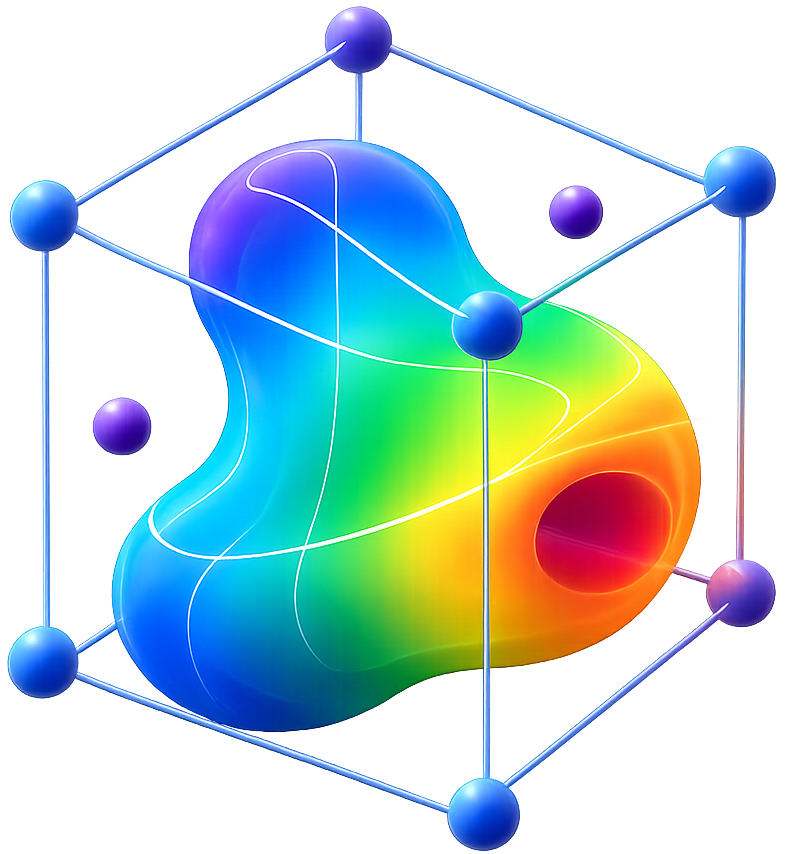

# VaspViz v4.1 — Professional VASP Electronic Structure Suite

**Developer:** Soumyajit Das, NIT Silchar

VaspViz is a comprehensive, cross-platform PyQt6-based application designed for the professional analysis and visualization of VASP (Vienna Ab initio Simulation Package) outputs. It offers a suite of interactive tools to inspect electronic structure, crystal geometry, convergence, and charge density, replacing the need for multiple disparate scripts and older visualization software. Developed using the help of AI.




## Key Features

### 📊 Electronic Structure Analysis
- **Band Structure & DOS**: Plot standard bands, Density of States (DOS), or both side-by-side (Band+DOS).
- **Fat Bands**: Visualize orbital contributions using bubble plots or continuous colormap projections.
- **Wannier90 Integration**: Overlay Wannier90 interpolated bands (`wannier90_band.dat`) with VASP DFT bands for direct comparison.
- **Band Selector**: Selectively plot or highlight specific band indices.
- **Optical Properties**: Calculate and visualize 9 optical spectra (σ, ε, n+ik, α, EELS, R) directly from `vasprun.xml`.
- **Advanced Analysis**: Quick band gap finder, effective mass fitting (parabolic CBM), and curvature analysis.
- **Brillouin Zone & Fermi Surface**: Automatic 3D visualization of the Brillouin zone and 2D Fermi surface contours.

### ⚛️ Structural & Volumetric Tools
- **POSCAR Viewer**: High-performance VESTA-style OpenGL 3D viewer for POSCAR/CONTCAR files with auto-bond detection and customizable element radii.
- **Charge Density**: 3D volumetric rendering of CHGCAR/PARCHG files, including spin-polarized magnetization density visualization.
- **Layer Builder**: Interactively build 2D heterostructures, including 24 predefined materials (e.g., TMDs like ZrX₂), moiré superlattices, and apply strain.

### 🛠️ Utilities & Workflow
- **K-Point Helper**: Interactive utility providing standard high-symmetry k-path labels (LaTeX formatted) for all 14 Bravais lattices.
- **K-Path Seeker**: Interactive 3D tool to visually select and design k-paths directly on the Brillouin zone.
- **P4Vasp Port (Convergence Monitor)**: Monitor energy, forces, and stress tensors across ionic steps during geometry optimizations by parsing `OUTCAR`/`OSZICAR`.
- **EOS Fitter**: Equation of State fitting module to analyze energy-volume data.
- **Plot Editor**: Extensive free-form customization of plots—colors, themes (Publication, Dark Neon, Nature, etc.), fonts, line widths, and DPI.
- **Export Capabilities**: Export publication-ready figures (HQ PNG up to 600 DPI, PDF, SVG, EPS) and raw data to CSV (bands, DOS, projections, gap reports).

## Installation & Requirements

VaspViz requires Python 3.8+ and the following dependencies:
- PyQt6
- PyQt6-3D (for hardware-accelerated rendering)
- matplotlib
- numpy
- scipy
- lxml
- pyqtgraph (for high-performance plotting in certain widgets)

You can install the dependencies via pip:
```bash
pip install PyQt6 matplotlib numpy scipy lxml pyqtgraph
```

## Usage

Run VaspViz from the command line:

```bash
python main.py [path_to_vasprun.xml]
```
If no file is provided, you can load your `vasprun.xml`, `POSCAR`, or `OUTCAR` directly from the application's File menu or toolbar.

### Keyboard Shortcuts
- `Ctrl+O` : Open vasprun.xml
- `Ctrl+S` : Save figure (PNG/PDF/SVG)
- `Ctrl+Q` : Quit
- `Ctrl+1` to `Ctrl+9` : Switch between workspace tabs

## Directory Structure
- `main.py` : Main application window and entry point.
- `constants.py` : Global constants, UI themes, and atomic data.
- `parsers.py` : High-performance parsers for `vasprun.xml`, `POSCAR`, `OUTCAR`, etc.
- `analysis.py` : Core analytical functions (band gap, effective mass, optics) and plot engines.
- `widgets.py` : Specialized UI panels (K-point helper, plot editor, P4Vasp, etc.).
- `layer_builder.py` : 2D structure building tool.
- `gl_viewer.py` : OpenGL-based 3D structure viewer.
- `chgcar_viewer.py` : Charge density and volumetric data visualizer.
- `eos_fitter.py` : Equation of State fitting module.

## Credits & Support
Developed by Soumyajit Das at the National Institute of Technology Silchar, Assam, India.

For bug reports, feature requests, or contributions, please contact the developer.
